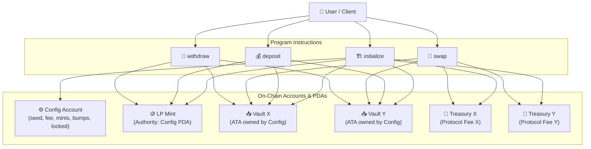
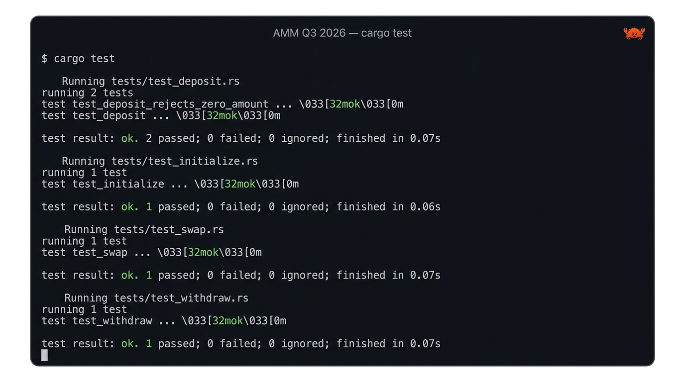

# 🌊 AMM Q3 2026 — Solana Automated Market Maker

> A fully on-chain **Constant Product AMM** ($x \cdot y = k$) built with [Anchor](https://www.anchor-lang.com/) on Solana. Supports liquidity provisioning, token swaps with protocol fees, and proportional withdrawals — verified with native Rust integration tests powered by [LiteSVM](https://github.com/LiteSVM/litesvm).

---

##  Program Deployment

- **Cluster:** Solana Devnet
- **Program ID:** `HMqTrRBxW996utybyhDGYcxRvhNtGYqiYzHx56k2zoFA`

---

##  Architecture



---

## 📦 Contract Details

### Program ID
`HMqTrRBxW996utybyhDGYcxRvhNtGYqiYzHx56k2zoFA`

### On-Chain State Structure

```rust
pub struct Config {
    pub seed: u64,                 // Unique pool identifier (used in PDA seed)
    pub authority: Option<Pubkey>, // Optional admin authority
    pub mint_x: Pubkey,            // Token X Mint address
    pub mint_y: Pubkey,            // Token Y Mint address
    pub fee: u16,                  // Fee in basis points (e.g. 30 = 0.30%)
    pub locked: bool,              // Emergency pool lock state flag
    pub config_bump: u8,           // PDA bump for Config account
    pub lp_bump: u8,               // PDA bump for LP Mint
    pub treasury_x_bump: u8,       // PDA bump for Treasury X
    pub treasury_y_bump: u8,       // PDA bump for Treasury Y
}
```

### Program Derived Addresses (PDAs)

| Account | PDA Seeds | Description |
|---|---|---|
| **Config** | `["config", seed.to_le_bytes()]` | Holds pool configuration and state |
| **LP Mint** | `["lp", config.key()]` | SPL Token mint for Liquidity Provider (LP) tokens |
| **Vault X** | Associated Token Account of `(config, mint_x)` | Holds Token X liquidity reserve |
| **Vault Y** | Associated Token Account of `(config, mint_y)` | Holds Token Y liquidity reserve |
| **Treasury X** | `["treasury_x", config.key()]` | Holds accumulated protocol fees in Token X |
| **Treasury Y** | `["treasury_y", config.key()]` | Holds accumulated protocol fees in Token Y |

---

## 🛠️ Instructions & Workflows

### 1. `initialize`
Initializes a new liquidity pool, configuration, LP mint, token vaults, and protocol treasury accounts.

```rust
pub fn initialize(
    ctx: Context<Initialize>,
    seed: u64,
    fee: u16,
    authority: Option<Pubkey>,
) -> Result<()>
```

* **Workflow:**
  1. Validates parameters and derives seeds.
  2. Sets up the pool `Config` state.
  3. Creates `vault_x` and `vault_y` associated token accounts owned by the Config PDA.
  4. Creates `treasury_x` and `treasury_y` accounts owned by the Config PDA.
  5. Initializes `mint_lp` token mint with mint authority set to the Config PDA.

---

### 2. `deposit`
Deposits liquidity into the pool in exchange for minted LP tokens.

```rust
pub fn deposit(
    ctx: Context<Deposit>,
    amount: u64,   // Amount of LP tokens to mint
    max_x: u64,    // Max Token X user is willing to deposit (slippage protection)
    max_y: u64,    // Max Token Y user is willing to deposit (slippage protection)
) -> Result<()>
```

* **Workflow:**
  1. Checks if pool is locked (`PoolLocked` error if locked).
  2. If first deposit (empty pool), deposits `max_x` and `max_y` directly.
  3. If existing pool, calculates required $x$ and $y$ using `ConstantProduct::xy_deposit_amounts_from_l`.
  4. Enforces slippage limits ($x \le max\_x$ and $y \le max\_y$).
  5. Transfers Token X & Token Y from user to pool vaults.
  6. Mints LP tokens to user (`MintTo` CPI using Config PDA signer).

---

### 3. `swap`
Swaps Token X for Token Y or vice versa using the Constant Product Curve algorithm.

```rust
pub fn swap(
    ctx: Context<Swap>,
    is_x: bool,          // true: Token X -> Token Y, false: Token Y -> Token X
    amount_in: u64,      // Amount of input token to swap
    min_amount_out: u64, // Minimum expected output token (slippage protection)
) -> Result<()>
```

* **Workflow:**
  1. Instantiates `ConstantProduct` curve with current vault amounts and fee rate.
  2. Calculates output amount and protocol fee breakdown.
  3. Ensures output amount $\ge min\_amount\_out$ (`SlippageExceeded` error if not met).
  4. Transfers `deposit_amount` (net of fee) from user to target vault.
  5. Transfers protocol `fee` from user to corresponding treasury account.
  6. Transfers output tokens from pool vault to user using Config PDA signer.

---

### 4. `withdraw`
Burns LP tokens to redeem proportional shares of Token X and Token Y reserves.

```rust
pub fn withdraw(
    ctx: Context<Withdraw>,
    amount: u64, // Amount of LP tokens to burn
    min_x: u64,  // Minimum Token X expected (slippage protection)
    min_y: u64,  // Minimum Token Y expected (slippage protection)
) -> Result<()>
```

* **Workflow:**
  1. Checks if pool is locked.
  2. Calculates proportional $x$ and $y$ withdrawal amounts via `ConstantProduct::xy_withdraw_amounts_from_l`.
  3. Enforces slippage bounds ($x \ge min\_x$ and $y \ge min\_y$).
  4. Burns `amount` of user's LP tokens (`Burn` CPI).
  5. Transfers Token X and Token Y from pool vaults to user using Config PDA signer.

---

## 🧮 How the AMM Works

The Automated Market Maker relies on the **Constant Product Formula**:

$$x \cdot y = k$$

Where:
* $x$ = Pool reserve of Token X
* $y$ = Pool reserve of Token Y
* $k$ = Invariant constant product

### 1. Pricing Mechanism
The relative price of Token X in terms of Token Y is determined dynamically by the ratio of vault reserves:

$$\text{Price}_X = \frac{\text{Vault}_Y}{\text{Vault}_X}$$

### 2. Fee Model
Swaps incur a configurable fee (specified in basis points during initialization, e.g., 30 bps = 0.30%):

$$\text{Fee} = \text{Amount In} \times \frac{\text{fee}}{10,000}$$

Protocol fees are deposited into separate treasury accounts (`treasury_x` and `treasury_y`) to protect liquidity pool accounting.

---

##  Test Suite & Verification

All instructions have comprehensive native Rust integration tests utilizing **LiteSVM** for rapid on-chain execution testing.

### Test Results



### Test Coverage Breakdown

| Test Name | File | Description | Status |
|---|---|---|---|
| `test_initialize` | `tests/test_initialize.rs` | Verifies Config state, PDAs, and token accounts initialization | ✅ PASSED |
| `test_deposit` | `tests/test_deposit.rs` | Verifies liquidity provision, vault balances, and LP minting | ✅ PASSED |
| `test_deposit_rejects_zero_amount` | `tests/test_deposit.rs` | Ensures zero amount deposits fail gracefully | ✅ PASSED |
| `test_swap` | `tests/test_swap.rs` | Verifies token swapping, slippage logic, and fee accumulation in treasury | ✅ PASSED |
| `test_withdraw` | `tests/test_withdraw.rs` | Verifies LP token burning and proportional liquidity redemptions | ✅ PASSED |

### Running Tests Locally

```bash
# Build program binary
anchor build

# Execute cargo test suite
anchor test
```

---

## 📁 Repository Structure

```
.
├── Anchor.toml
├── Cargo.toml
├── assets/
│   └── test_results.jpg
└── programs/
    └── amm-q3-2026/
        ├── Cargo.toml
        ├── src/
        │   ├── constants.rs
        │   ├── error.rs
        │   ├── instructions/
        │   │   ├── deposit.rs
        │   │   ├── initialize.rs
        │   │   ├── swap.rs
        │   │   └── withdraw.rs
        │   ├── instructions.rs
        │   ├── lib.rs
        │   └── state.rs
        └── tests/
            ├── common/
            │   └── mod.rs
            ├── test_deposit.rs
            ├── test_initialize.rs
            ├── test_swap.rs
            └── test_withdraw.rs
```
